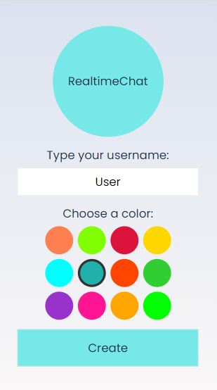
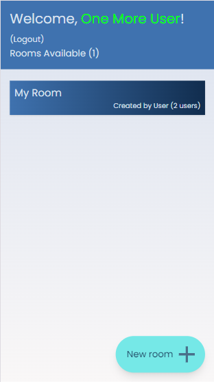
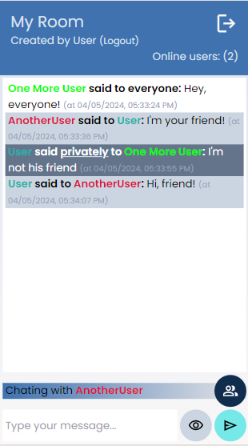

# UO Realtime Chat

UO Realtime Chat is a web application to provide communication between anonymous users.

It's based on the famous Brazilian web chat "Bate-papo UOL".

## Technologies

- ReactJS + VITE
- Firebase's Realtime Database
- TailwindCSS
- CryptoJS
- Firebase's Hosting

## Screens

